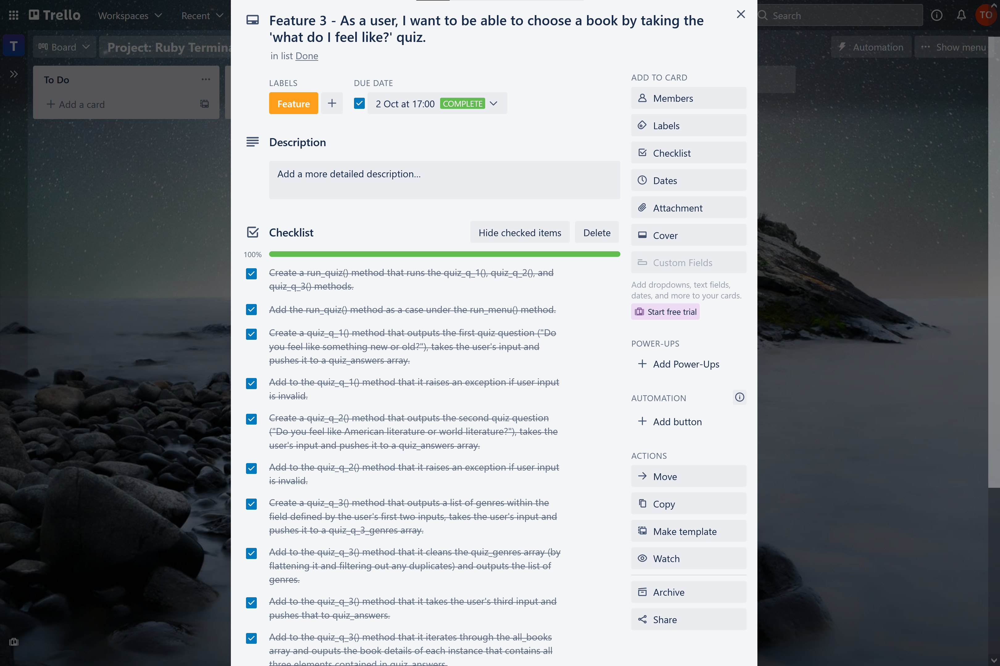
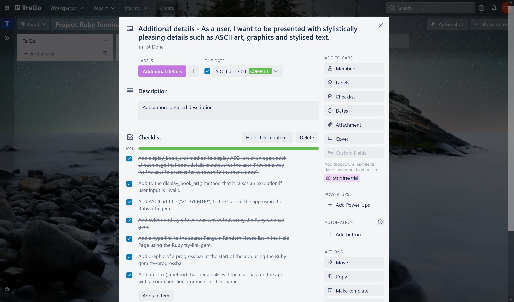

# Project: Ruby Terminal App

## Key Details

---

#### App

21 Books You've Been Meaning To Read (21 BYBMTR) - a terminal app to help you choose which book to read next.

#### GitHub repository

https://github.com/tigerob/T1A3

---

---
<br>

## Help Documentation

---


### Installation

1. You need to use the Ruby programming language to run this app. If you don't already have Ruby installed, you can refer to the Ruby installation guide [here](https://www.ruby-lang.org/en/documentation/installation/) to install it.
   
2. You need to use Git to download a copy of the app to your home directory. If you don't already have Git installed, you can install it from [here](https://git-scm.com/downloads).
   
3. You also need to use an SSH key to download a copy of the app to your home directory. If you don't already have an SSH key, you can follow [these instructions](https://docs.github.com/en/authentication/connecting-to-github-with-ssh/generating-a-new-ssh-key-and-adding-it-to-the-ssh-agent) to generate a new SSH key and add it to the ssh-agent.
   
4. Run this command in terminal to Git clone the app from my GitHub repository to a directory of your choosing within your home directory (ensuring that you are in your chosen directory when you run the command):
    ```
    git clone git@github.com:tigerob/T1A3.git
    ```

5. Navigate to the *src/* directory.

6. **Dependencies** -  This app requires the following Ruby gems to run properly: *artii* (\~> 2.1), *colorize* (\~> 0.8.1), *rspec* (\~> 3.10), *tty-link* (\~> 0.1.1), *tty-progressbar* (\~> 0.18.2). You can either install them individually with the command ```gem install <name of gem>``` or you can use the Ruby gem *bundler* to automatically install all dependencies. The latter option is more convenient and you could do that by running the following commands in terminal:
    ```
    gem install bundler
    ``` 
    ```
    bundle install
    ```

---

### Run

Run the app in any of the following ways with the following commands:

1. Run the shell script for the app:
   ```
   ./run_21BYBMTR.sh
   ```
   
2. Run the shell script for the app opening at the Help Page:
   ```
   ./run_21BYBMTR_with_help_page.sh
   ```
   
3. Run the Ruby file for the app without any command-line arguments:
   ```
   ruby main.rb
   ```
   
4. Run the Ruby file for the app with your choice of the following command-line arguments:
   
   1. run the app opening at the Help Page:
        ```
        ruby main.rb -h
        ``` 
   
   2. run the app with a personal touch, incorporating the name you input at \<name>:
        ```
        ruby main.rb -n <name>
        ```

---

### Features & User Interaction

See 'Features' and 'User Interaction' in the Software Development Plan below for instructions on how to use the app's features.

---

---
<br>

## Software Development Plan
---

### Purpose

**Problem**: The dilemma of choosing which book to read next.

**Solution**: A terminal app that knows Penguin Random House’s 'The 21 Books You've Been Meaning To Read' and gives the user various interactive ways to choose one or more of these books.[^1]

**Target audience**: Anyone who is interested in inspiration for which book to read next and is open to considering highly esteemed works of literature published approximately within the past four centuries.

This terminal app presents the user with a menu of options for choosing a book. Those are: (1) from the full list; (2) by genre; (3) by quiz; and (4) by random selection. See 'Features' below for a full explanation of these options and see 'User Interaction' below for a full explanation of how a member of the target audience will interact with this app.

I've chosen this Penguin Random House list primarily because of Penguin Random House's longstanding reputation as a quality global publisher of literature. I have confined the scope of this app to the Penguin Random House list for the purposes of this project. However, the app could be amended in future to build out the book list so that the app contains an even more extensive file of books for the user.

[^1]: Penguin Random House, ‘21 Books You've Been Meaning To Read’, PenguinRandomhouse.com, viewed 27 September 2021, <<https://www.penguinrandomhouse.com/the-read-down/21-books-youve-been-meaning-to-read/>>.

---

### Features

This app possesses the following features:

**1. Provide the user with a way to choose a book from the full list of books**

This feature outputs the book details of each book in the book list.

It operates by iterating through the ```all_books``` array, each element of which is an instance of the ```Book``` class, and outputting the book details that were initialized for that instance. The ```all_books``` array contains all the books on the list.

**2. Provide the user with a way to choose a book by genre**

This feature outputs a list of all genres. Once a user inputs a specific genre, this feature then outputs the book details of all books within that genre.

It operates by iterating through the ```all_books``` array and outputting the book details of each instance for which the array of genres that was initialized for that instance includes the input genre.

**3. Provide the user with a way to choose a book by taking the 'what do I feel like?' quiz**

This feature outputs the first quiz question ("Do you feel like something new or old?"). Once a user inputs an answer, this feature then outputs the second quiz question ("Do you feel like American literature or world literature?"). Once the user inputs an answer, this feature then outputs a list of genres within the field defined by the user's first two inputs. Once the user inputs a genre, this feature then outputs the book details of all books that accord with the user's three inputs.

It operates by pushing the user's first two inputs to the ```quiz_answers``` array. It then iterates through the ```all_books``` array and, for each instance that contains the same tags stored in ```quiz_answers```, pushes the genres for that instance into the ```quiz_genres``` array. It cleans the ```quiz_genres``` array (by flattening it and filtering out any duplicates) and outputs the list of genres. It takes the user's third input and pushes that to ```quiz_answers```. Finally, it iterates through the ```all_books``` array and ouputs the book details of each instance that contains all three elements contained in ```quiz_answers```.

**4. Provide the user with a random choice of book**

This feature outputs the book details of a random book from the list.

It operates by outputting the book details of an instance randomly selected from the ```all_books``` array using the in-built Ruby ```.sample``` method.

**5. Provide the user with a way to exit the app**

This feature terminates the app process and returns the user to the terminal shell prompt.

It operates by running the in-built Ruby ```exit``` method to exit the user from the infinite loop of the app.

**6. Provide the user with a way to access a Help Page for the app**

This feature outputs the Help Page, which contains basic information for the user about the app and about use of the app, prior to the menu of the app.

It operates by using a conditional control structure to run the ```help_page``` method if the user runs the app with the command-line argument ```-h```.

---

### User interaction

The app provides directions to the user at each page on how to interact with that page. For example, the menu page includes directions to the user to "enter a number to continue".

The user interacts with the app by using both command-line arguments and inputs of letters, numbers and the enter key on their keyboard for in-app interaction.

#### **Command-line arguments**

See step 4 of 'Run' under the Help Documentation above for an explanation of the different command-line arguments the user can use to interact with the app.

#### **In-app interaction**

At the menu, the user must enter a number from 1 to 5 to proceed with one of the menu options.

At the output of menu option 1, the user must press enter to return to the menu.

At the output of menu option 2, the user must enter a number from 1 to 13 to proceed with one of the listed genres. At the next output, the user must press enter to return to the menu.

At the output of menu option 3, the user must enter either 'new' or 'old' to proceed. At the next output, the user must enter either 'American' or 'world' to proceed. At the next output, the user must enter one of the listed genres to proceed. At the next output, the user must press enter to return to the menu.

At the output of menu option 4, the user must press enter to return to the menu.

At the Help Page, the user must press enter to continue to the menu.

#### **Exception-handling**

If the user enters an invalid input at any point of the in-app interactions, the app raises an exception and returns a message to the user with directions on how to enter a valid input. For example, if the user enters anything other than the numbers 1 to 5 at the menu page, the app returns a message of "Please type in a number from 1 to 5 to proceed!".

---

### Control-flow diagram


---

### Implementation

Project implementation was managed and documented by [this Trello board](https://trello.com/b/aFVSa40o/project-ruby-terminal-app-t1a3). Screenshots included below:







---

### Testing

Testing of this app has involved both automatic and manual tests.

Automatic testing was performed with the Ruby gem *RSpec*. See the *src/spec/* directory for details of these tests.

Manual testing is documented in [this spreadsheet](https://docs.google.com/spreadsheets/d/1PvqB1MU8PR_kv7414R-fcbAOvyT35I_X-Ep74Ys93eA/edit?usp=sharing). Screenshot included below:

